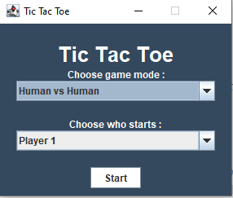

<h1>TIC TAC TOE Implementation</h1>

	</img>

<h2> Introduction </h2>

	TIC TAC TOE (also known as Noughts and Crosses or Xs and Os) is a simple game for two players, X and O , who
	take turns marking the spaces in a 3x3 grid.The player who succeds in placing three of their marks in a 	horizantal ,vertical or diagonal row wins the game. The basic idea is to use two-dimensional array (board) 	   to maintain the game board. Cells in this array store values that indicate if that cell is empty or stores 	      an X or O. In the code implemented the cells in the board array are intergers 2 and 1 representing X and O.
	The game operates in two modes.of 
		Mode 1 : Human vs Human where both the players are human.
		Mode 2 : Human vs Computer where the opponent is Computer(Minimax AI Algorithm).
		
## How to Play the Game :
	Choose the mode of the game in the GameWindow.
	Both the players choose either X or O to mark their cells.
	There will be a 3×3 grid UI implemented using swing.
	The player who chose O begins to play first.
	He clicks on the cell where he wishes to place O.
	If the player is a computer he automatically chooses a cell using Minimax Algorithm.
	Now, both O and X play alternatively until any one of the two wins.
	Winning criteria: Whenever any of the two players has fully filled one row/ column/ diagonal with his symbol 	     (X/ O), he wins and the game ends.
	If neither of the two players wins, the game is said to have ended in a draw
