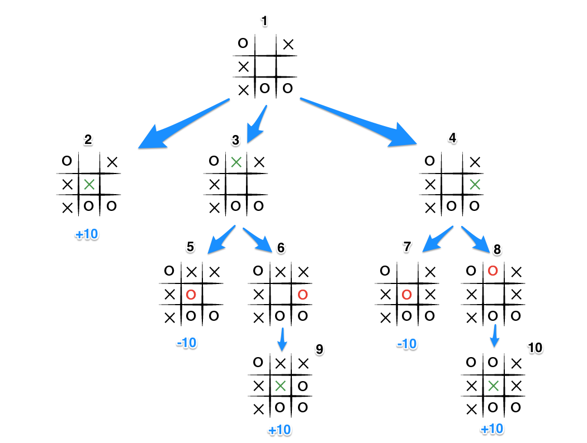

<h1>TIC TAC TOE Implementation</h1>

<p align="center">
	</img>
</p>

<h2> Introduction </h2>

<b>TIC TAC TOE</b> (also known as Noughts and Crosses or Xs and Os) is a simple game for two players, X and O , who
take turns marking the spaces in a 3x3 grid.The player who succeds in placing three of their marks in a 	
horizantal ,vertical or diagonal row wins the game. The basic idea is to use two-dimensional array (board) 	   
to maintain the game board. Cells in this array store values that indicate if that cell is empty or stores 	      
an X or O. In the code implemented the cells in the board array are intergers 2 and 1 representing X and O.
The game operates in two modes.of 
	Mode 1 : Human vs Human where both the players are human.
	Mode 2 : Human vs Computer where the opponent is Computer(Minimax AI Algorithm).
	
<p align='center'>
	</img>
</p>
<p align='center'>
	</img>
</p>

		
## How to Play the Game :
	Choose the mode of the game in the GameWindow.
	Both the players choose either X or O to mark their cells.
	There will be a 3×3 grid UI implemented using swing.
	The player who chose O begins to play first.
	He clicks on the cell where he wishes to place O.
	If the player is a computer he automatically chooses a cell using Minimax Algorithm.
	Now, both O and X play alternatively until any one of the two wins.
	Winning criteria: Whenever any of the two players has fully filled one row/ column/ diagonal with his symbol 	     
	(X/ O), he wins and the game ends.
	If neither of the two players wins, the game is said to have ended in a draw

<b>The sample code of winninglogic for anyone of the player is stated below.</b>
```java
public boolean hasOWon() {
	if ((board[0][0] == board[1][1] && board[0][0] == board[2][2] && board[0][0] == 2) 
	|| (board[0][2] == board[1][1] && board[0][2] == board[2][0] && board[0][2]  == 2)) {
		return true;
	}
	for (int i = 0; i < GRID_SIZE; i++) {
	    if ((board[i][0] == board[i][1] && board[i][0] == board[i][2] && board[i][0] == 2) 
	    || (board[0][i] == board[1][i] && board[0][i] == board[2][i] && board[0][i] == 		2)) {
		return true;
	    }
}
```

## MiniMax Algorithm

<b>Minimax</b> is a decision-making algorithm, typically used in a turn-based, two player games. The goal of the algorithm is to find the optimal next move.
In the algorithm, one player is called the maximizer, and the other player is a minimizer. If we assign an evaluation score to the game board, one player tries to choose a game state with the maximum score, while the other chooses a state with the minimum score.
In other words, the maximizer works to get the highest score, while the minimizer tries get the lowest score by trying to counter moves.
It is based on the zero-sum game concept. In a zero-sum game, the total utility score is divided among the players. An increase in one player's score results into the decrease in another player's score. So, the total score is always zero. For one player to win, the other one has to lose.

## Understanding the Algorithm:
The algorithm search, recursively, the best move that leads the Max player to win or not lose (draw). It consider the current state of the game and the available moves at that state, then for each valid move it plays (alternating min and max) until it finds a terminal state (win, draw or lose).Here is the code of minimax algorithm that is used in this game .
<p>
</img>
</p>

<b> Now let's break down the code to understand it further.</b>

> board = [
>	[0, 0, 0],
>	[0, 0, 0],
>	[0, 0, 0]
> ]

> MAX = Integer.MIN_VALUE

> MIN = Integer.MAX_VALUE

The MAX may be X or O and the MIN may be O or X, whatever. The board is 3x3. Both players start with your worst score. 
If player is MAX, its score is -infinity. Else if player is MIN, its score is +infinity.

```java
if (depth == maxDepth || isGameOver()) return analyseGameState();
List<Cell> states = getEmptyCells();
if (states.isEmpty()) return 0;
```
	
If the states is equal zero, then the board hasn't new empty cells to play.Or if the maximum depth has reached . Or, if a player wins, then the game ended for MAX or MIN. So the score for that state will be returned.

```java
public boolean isGameOver() {
	return (hasXWon() || hasOWon() || getEmptyCells().isEmpty());
}
public Result getGameResult() {
if (hasXWon()) {
    return Result.XWON;
} else if (hasOWon()) {
    return Result.OWON;
} else {
    return Result.DRAW;
}
}
```
<b> Now let's analyze the main part of the code - recursion.</b>

```java	
for (Cell cell : states) {
    int score;
    if (turn == Turn.COMPUTER) {
	setCell(cell, turn);
	score = minimaxAlgorithm(Turn.PLAYER, depth + 1, alpha, beta);
	maxValue = Math.max(maxValue, score);
	if (depth == 0)
	    possibleMoves.add(new Cell(cell.x, cell.y, score));
    } else if (turn == Turn.PLAYER) {
	setCell(cell, turn);
	score = minimaxAlgorithm(Turn.COMPUTER, depth + 1, alpha, beta);
	minValue = Math.min(minValue, score);
  }
  ```
	  
For each valid moves (empty cells/states):
* Set the cell as 2 or 1 according to turn.
* Recursively call minimaxAlgorithm by increasing depth till the depth limit has reached.
* The next step is compare the score with best.
* If the depth is zero while it's computer's turn add the cell to possible moves along with its score.
* The cell state is resetted returning score max or min value the node can get..

```java
  board[cell.x][cell.y] = 0;
  }
  return (turn == Turn.COMPUTER) ? maxValue : minValue;
```

## Analyzing by building a Game Tree
The key to the Minimax algorithm is a back and forth between the two players, where the player whose "turn it is" desires to pick the move with the maximum score. In turn, the scores for each of the available moves are determined by the opposing player deciding which of its available moves has the minimum score. And the scores for the opposing players moves are again determined by the turn-taking player trying to maximize its score and so on all the way down the move tree to an end state.

A description for the algorithm, assuming X is the "turn taking player," would look something like:

If the game is over, return the score from X's perspective.
Otherwise get a list of new game states for every possible move
Create a scores list
For each of these states add the minimax result of that state to the scores list
If it's X's turn, return the maximum score from the scores list
If it's O's turn, return the minimum score from the scores list
You'll notice that this algorithm is recursive, it flips back and forth between the players until a final score is found.
Let's walk through the algorithm's execution with the full move tree, and show why, algorithmically, the instant winning move will be picked

<p> </img>

* It's X's turn in state 1. X generates the states 2, 3, and 4 and calls minimax on those states.
* State 2 pushes the score of +10 to state 1's score list, because the game is in an end state.
* State 3 and 4 are not in end states, so 3 generates states 5 and 6 and calls minimax on them, while state 4 generates states 7 and 8 and calls minimax on them.
* State 5 pushes a score of -10 onto state 3's score list, while the same happens for state 7 which pushes a score of -10 onto state 4's score list.
* State 6 and 8 generate the only available moves, which are end states, and so both of them add the score of +10 to the move lists of states 3 and 4.
* Because it is O's turn in both state 3 and 4, O will seek to find the minimum score, and given the choice between -10 and +10, both states 3 and 4 will yield -10.
* Finally the score list for states 2, 3, and 4 are populated with +10, -10 and -10 respectively, and state 1 seeking to maximize the score will chose the winning move with score +10, state 2.

### Resources:
* Book: George T. Heineman; Gary Pollice; Stanley Selkow. Algorithms in a nutshell. O'Reilly, 2009.
* Wikipédia: <https://en.wikipedia.org/wiki/Minimax>
* Medium Article : <https://medium.com/free-code-camp/how-to-make-your-tic-tac-toe-game-unbeatable-by-using-the-minimax-algorithm-9d690bad4b37?source=search_post---------1>
* GeeksforGeeks : <https://www.geeksforgeeks.org/minimax-algorithm-in-game-theory-set-1-introduction/?ref=leftbar-rightbar>
